# simple-starter-core

`simple-starter-core` 是 simple-starter 框架的**运行时核心**：提供配置管理、组件模型、依赖注入、插件系统、事件系统、任务调度与生命周期管理。web / security 等插件与用户应用都构建在它之上。

## 一、基本原理

### 1. 组件模型

组件是框架管理的最小单元。每个组件经历完整的生命周期：

1. **注册**：`#[component]` / `#[provider]` / `#[configuration]` 宏在编译期生成静态注册元数据（`ComponentProcessorFactory`），通过 `inventory` 自动收集（Rust 无反射，依赖编译期静态收集）。
2. **条件过滤**：注册期统一评估 `condition` 表达式，不满足者不参与装配。
3. **依赖排序**：基于组件声明的四类依赖（名称 / trait / 类型 / primary）构建有向图，Kahn 拓扑排序得到创建顺序；存在依赖环时排序结果数小于组件总数，报错并给出环路径。
4. **创建**：按依赖序调用构造函数，非注入字段使用 `Default::default()` 填充。
5. **初始化**：每个组件创建完成后**立即**执行 `init_method`（注入完成后即执行，对应 Spring `@PostConstruct`；拓扑序保证依赖组件先完成 create + init，init 内可安全访问全部依赖组件）。方法签名 `async fn init(&self)`：以 `Arc<T>` 共享引用调用，实例所有权仍在仓库，仅能读取/借用自身。
6. **容器就绪批次（可选）**：全部组件创建 + 初始化完成后，按创建序批次执行 `ComponentLifecycle::after_all_ready`（对应 Spring `SmartInitializingSingleton`）。
7. **销毁前批次（可选）**：退出时先按创建序逆序批次执行 `ComponentLifecycle::before_destroy`（此时全局缓存未清空、全部组件存活可互相解析），再进入逐组件销毁。
8. **销毁**：按创建序的逆序执行 `destroy_method`。方法签名 `async fn destroy(self)`：与 init 不同，以「有所有权」的实例 `T` 调用，所有权已从仓库移出，可消费字段、取出内部资源。销毁时要求无其他地方持有该实例（`Arc` 计数为 1），且无论组件是否实现 `destroy_method` 都强制校验：引用泄漏（计数 > 1）将报错暴露，而非静默不释放。

### 2. 依赖注入

注入目标支持三种形态，依赖声明方式决定注入策略：

| 字段/参数形态 | 注入语义 | 依赖声明 |
|---|---|---|
| `Arc<T>`（无名称） | 按具体类型注入（短名快速路径 + 按类型唯一实例兜底，自定义名也能命中） | 类型 TypeId |
| `Arc<T>`（有名称） | 按组件名精确注入 | 组件名 |
| `Arc<dyn Trait>`（无名称） | 按 trait 注入唯一实现（多个实现报错） | trait TypeId |
| `Arc<dyn Trait>`（有名称） | 按 trait + 名称注入指定实现 | 组件名 |
| `Vec<Arc<dyn Trait>>` | 收集该 trait 的全部实现 | trait TypeId |
| `Arc<T>` + `#[inject_primary]` | 注入该类型的 primary（首要）实例 | 类型 TypeId |

### 3. trait 对象注入与"trait 还原"原理

`Arc<dyn Trait>` 注入的关键难点是：trait 对象是**胖指针**（数据指针 + vtable 指针），而 Rust 的 vtable 布局未规范化，无法仅凭类型信息从零构造。

框架的解法是"**记录 + 还原**"两步：

1. **写入侧（coercion 瞬间记录）**：`#[injectable]` 宏生成 accessor，在 `Arc<ConcreteType>` 被向上转型（upcasting coercion）为 `Arc<dyn Injectable>` 的那一刻，编译器算出真实的 vtable——accessor 顺势把这个 vtable 与数据指针一起写入缓存条目 `TraitObjectEntry`（vtable 是 `'static` 只读数据，可安全长期保存）。
2. **读取侧（拼回胖指针）**：注入时取出缓存的"数据指针 + 记录 vtable"，拼回 `Arc<dyn Trait>` 胖指针，完成 trait 还原。

配合 `TypeId` 直接匹配（trait 依赖在宏展开期生成 `TypeId::of::<dyn Trait>()`，const fn 编译期求值），全程无字符串桥接，跨 crate 同名 trait 不冲突。

### 4. 插件系统

插件是框架级的扩展单元，按拓扑顺序（`dependencies()` 声明依赖）执行三阶段生命周期，与组件加载严格编排：

```
插件排序 → assemble（装配期）→ 组件加载 → components_ready（组件就绪期）→ finalize（收尾期）→ 启动钩子
```

| 周期 | 时机 | 职责 |
|---|---|---|
| `assemble` | 组件加载前 | 将扩展注册表放入扩展存储（`Extensions`，本阶段唯一协作面），供其他插件注册扩展 |
| `components_ready` | 组件全部 create + init 后 | 从组件仓库获取协作接口实例，构建插件协作结构（如中间件状态） |
| `finalize` | 所有插件就绪后 | 消费扩展注册表、构建并启动服务 |

### 5. 配置分层

配置按优先级从低到高合并：**硬编码默认 → 插件默认配置 → 用户代码默认配置 → application.toml → application-{profile}.toml**。合并后的全局配置由 `AppContext` 持有（`AppContext::config()`），经插件 components_ready / finalize、启动/关闭钩子与 create 回调（配置组件）分发；通过 `get_config_value_by_path(&config, "a.b.c")` 按点分路径读取，或 `get_config_to_struct::<T>(&config, "prefix")` 反序列化为结构体。

### 6. 条件注册

`#[component(condition = ...)]` / `#[provider(condition = ...)]` 支持注册期条件评估：条件不满足的组件自动退位。这是"插件提供默认实现、用户覆盖"的核心机制，详见下文 `ComponentCondition`。

## 二、导出的用户可用组件与 API

### 1. Application（应用构建器）

`Application` 是应用入口，采用链式构建 + `run()` 启动：

```rust
fn main() {
    Application::new()
        .register_plugin(MyPlugin::new())        // 注册插件（可多次）
        .add_default_config(toml! { /* ... */ }) // 代码内默认配置
        .add_startup_hook(|ctx| async move {     // 启动钩子（接收 &mut AppContext）
            let db = ctx.container().get_component::<Database>()?;
            Ok(())
        })
        .add_shutdown_hook(|ctx| async move { Ok(()) }) // 关闭钩子（接收 &mut AppContext）
        .run();
}
```

| 方法 | 说明 |
|---|---|
| `new()` | 创建实例 |
| `register_plugin(p)` | 注册插件（依赖关系自动拓扑排序） |
| `add_default_config(v)` | 添加代码内默认配置（优先级高于插件默认、低于配置文件） |
| `add_startup_hook(f)` / `add_shutdown_hook(f)` | 启动/关闭钩子（async 闭包，接收 `&mut AppContext` 可查询组件/读取配置/注册后台任务） |
| `set_tokio_runtime_factory(f)` | 自定义 Tokio 运行时工厂 |
| `add_log_layer_factory(l)` | 追加自定义 tracing layer |
| `set_main_loop_hook(f)` | 自定义主循环（GUI 框架接管主线程，钩子按值接收 Application；主循环结束后 Application 析构自动执行关闭流程，主循环不返回时需在进程退出前手动 `drop(application)`） |
| `context()` / `context_mut()` | 获取应用上下文 `AppContext`（配置、组件容器、扩展存储、后台任务注册器） |
| `get_runtime_as_ref()` / `get_runtime_as_mut()` | 获取 Tokio 运行时引用（日常使用经 `handle().clone()` 跨线程 spawn） |
| `run()` | 启动应用（阻塞） |

> 关闭流程由 `Drop` 自动执行（取消任务 → 关闭钩子 → 插件逆序关闭 → 组件逆序销毁），无需用户显式调用。
> 若宿主进程绕过析构直接终止（如 GUI 框架经 `std::process::exit` 退出），`Drop` 不会触发，需在进程退出前手动 `drop(application)` 保证关闭流程执行。
> 注意：`Application` 不能在 Tokio 运行时上下文内 drop（`block_on` 约束）。

### 2. 应用上下文与配置（运行时获取工具）

组件查询与配置读取统一经 `AppContext`（`Application::context()` / 插件与钩子的 `&mut AppContext` 参数）：

| API | 说明 |
|---|---|
| `AppContext::config()` / `container()` | 全局配置（`Arc<Value>`）/ 组件容器（`Arc<ComponentContainer>`） |
| `get_config_value_by_path(&config, "a.b")` | 按点分路径读取配置值 |
| `get_config_to_struct::<T>(&config, "prefix")` | 按前缀反序列化配置为结构体 |
| `insert_extension(v)` / `get_extension::<T>()` / `get_extension_mut::<T>()` / `remove_extension::<T>()` | 扩展上下文（AnyMap），插件间传递协作数据 |
| `add_task_spawn_factory_in_context(f)` | 注册异步后台任务（接收 CancellationToken，优雅退出） |
| `get_component::<T>()` | 按类型获取组件（短名快速路径，自定义名时按唯一实例兜底） |
| `get_component_by_name::<T, _>("name")` | 按名称获取组件 |
| `get_primary_component::<T>()` | 按类型获取 primary 实例（未声明 primary 时回退为唯一实例） |
| `get_component_by_trait::<dyn Trait>()` | 按 trait 获取唯一实现 |
| `get_component_by_trait_and_name::<dyn Trait>("name")` | 按 trait + 名称获取指定实现 |
| `get_components_by_trait::<dyn Trait>()` | 收集 trait 全部实现 `Vec<Arc<dyn Trait>>` |
| `app_container()` / `app_config()` | 全局上下文快照读取（无上下文传播场景的只读访问点，详见下文） |

#### 全局上下文快照（无上下文传播场景的读取点）

`app_container()` / `app_config()` 以全局静态快照镜像 `AppContext` 的组件容器与全局配置（`Arc` clone，不转移所有权），供**无上下文传播的场景**读取：用户自建后台线程、无法注入的工具函数等。典型用法是路由宏的 `state` 表达式（路由构建发生在插件 finalize 期，晚于快照安装）：

```rust
#[get(
    path = "/student/{id}",
    state = simple_starter_core::app_container()
        .expect("global container snapshot must be installed before route registration")
        .get_component::<StudentService>()
        .expect("StudentService component must be registered")
)]
```

- **安装**：全部组件创建与初始化完成、容器冻结之后（`after_all_ready` 批次前）写入并冻结——此后任意线程零锁读
- **清空**：销毁前批次（`before_destroy`）执行完毕、销毁循环开始之前清空——此后读取返回 `None`
- **合法窗口**：仅在 `after_all_ready` 与 `before_destroy` 之间（运行期）可读，窗口外返回 `None`
- **单实例约束**：静态槽位进程内全局唯一，同一进程先后启动多个 `Application` 时第二次安装 panic（fail-fast）
- **定位**：这是依赖注入之外的逃生舱，不是注入机制的替代——能通过字段注入 / 钩子参数拿到上下文的代码应优先使用注入

### 3. 核心宏（本模块重导出，无需依赖 macro）

| 宏 | 作用 |
|---|---|
| `#[component]` | 标记结构体为组件：`name` / `init_method` / `destroy_method` / `condition` |
| `#[provider]` | 标记函数为组件工厂（适用于第三方类型或复杂初始化） |
| `#[primary]` | 配合 `#[provider]` 声明返回类型的首要实例 |
| `#[configuration]` | 标记结构体为配置组件，从全局配置反序列化 |
| `#[inject]` | 标记字段/参数注入依赖 |
| `#[inject_primary]` | 标记字段/参数按 primary 实例注入 |
| `#[injectable]` | 标记 trait 实现，注册 trait → 实现映射 |
| `#[lifecycle]` | 标记 `ComponentLifecycle` 实现，注册容器级周期回调（`after_all_ready` / `before_destroy`） |
| `#[cron_job]` | 声明式定时任务 |
| `#[event_listener]` | 声明式事件监听器 |

```rust
use simple_starter_core::{component, configuration, cron_job, inject, injectable, provider, primary};

// 配置组件：从 TOML 的 [database] 段反序列化
#[derive(serde::Deserialize)]
#[configuration("database")]
struct DbConfig { url: String }

// 函数工厂：适用于第三方类型 DatabaseConnection；参数自动按类型注入
#[provider]
async fn db_factory(cfg: std::sync::Arc<DbConfig>) -> anyhow::Result<DatabaseConnection> {
    Database::connect(&cfg.url).await
}

// 多实例 + primary：mainDb 是按类型获取时的首要实例
#[provider(name = "mainDb")]
#[primary(name = "mainDb")]
async fn main_db() -> anyhow::Result<DatabaseConnection> { /* ... */ }

// 结构体组件：字段注入依赖，init_method 在注入完成后立即执行
#[component(init_method = "init")]
struct UserService {
    #[inject]
    db: std::sync::Arc<DatabaseConnection>,
}
impl UserService {
    async fn init(&self) -> anyhow::Result<()> { Ok(()) }
}

// 容器级周期（可选）：全部组件就绪后 / 全部组件销毁前批次回调，
// 两方法均有默认空实现，按需覆写；签名带容器 Arc 引用（与 AppContext::container()
// 返回形态一致），deref 直接查询，需传播所有权时显式 clone
#[lifecycle]
#[async_trait::async_trait]
impl simple_starter_core::ComponentLifecycle for UserService {
    async fn after_all_ready(&self, container: &std::sync::Arc<simple_starter_core::ComponentContainer>) -> anyhow::Result<()> {
        let _ = container;
        Ok(())
    }
}

// 定时任务
#[cron_job("*/5 * * * * *")]
async fn heartbeat_task() { /* 每 5 秒执行 */ }
```

### 4. Plugin trait（自定义插件）

```rust
#[async_trait::async_trait]
impl Plugin for MyPlugin {
    fn name(&self) -> &'static str { "MyPlugin" }
    fn dependencies(&self) -> &[&'static str] { &["WebPlugin"] }  // 可选：声明依赖
    fn default_config(&self) -> toml::Value { /* 可选：插件默认配置 */ }

    // 装配期：仅授予扩展存储，组件尚未创建、配置与任务工厂不可见
    async fn assemble(&mut self, extensions: &mut simple_starter_core::Extensions) -> anyhow::Result<()> { Ok(()) }
    async fn components_ready(&mut self, ctx: &mut simple_starter_core::AppContext) -> anyhow::Result<()> { Ok(()) }
    async fn finalize(&mut self, ctx: &mut simple_starter_core::AppContext) -> anyhow::Result<()> { Ok(()) }
}
```

### 5. Injectable trait（可注入 trait 的 supertrait）

所有可注入 trait 必须继承 `Injectable`（`Any + Send + Sync` 的 blanket impl），使所有 trait 对象可统一类型擦除：

```rust
use simple_starter_core::Injectable;

pub trait FileParser: Injectable {
    fn parse(&self, content: &str) -> anyhow::Result<Vec<String>>;
}
```

### 6. ComponentCondition（条件注册）

| 条件 | 语义 |
|---|---|
| `on_missing_type::<T>()` | 无其他已注册组件是具体类型 `T`（默认实现 + 用户覆盖） |
| `on_missing_trait::<dyn Trait>()` | 无其他已注册组件实现该 trait（trait 替换默认实现） |
| `on_property("a.b")` | 全局配置存在该点分路径键 |
| `on_property_eq("a.b", "v")` | 全局配置该键的字符串值等于 `v` |
| `Custom(fn(&ConditionContext) -> bool)` | 用户自定义条件 |

```rust
// 默认实现：仅当用户未提供 CacheService 实现时才注册
#[component(condition = simple_starter_core::ComponentCondition::on_missing_trait::<dyn CacheService>())]
pub struct DefaultCacheService;
```

### 7. 事件系统（Spring 风格发布/监听）

```rust
use simple_starter_core::{event_listener, inject, AppEvent, EventPublisherExt, component};

// 1. 定义事件：实现 AppEvent 标记 trait
#[derive(Debug)]
struct UserLoginEvent { user_id: String }

// 2. 定义监听器：impl 块 + #[event_listener]，随组件注册自动收集
#[component]
struct LoginListener;
#[event_listener]
#[async_trait::async_trait]
impl EventListener<UserLoginEvent> for LoginListener {
    async fn on_event(&self, event: &UserLoginEvent) -> anyhow::Result<()> { Ok(()) }
}

// 3. 发布：注入 EventPublisher，调用 publish_event
#[component]
struct LoginService {
    #[inject]
    publisher: std::sync::Arc<dyn EventPublisher>,
}
impl LoginService {
    async fn login(&self) -> anyhow::Result<()> {
        self.publisher.publish_event(UserLoginEvent { user_id: "1".into() }).await
    }
}
```

- `AppEvent`：事件标记 trait（blanket impl）
- `EventListener<E>`：监听器 trait，`#[event_listener]` 作用于 impl 块完成注册
- `EventPublisher`：发布器 trait；框架提供默认实现（`on_missing_trait` 条件注册，用户注册自己的 `EventPublisher` 实现时自动退位）；`EventPublisherExt::publish_event` 是便捷方法
- 分派：按事件具体类型 `type_id` 分桶，监听器失败仅记日志，不中断广播
- 生命周期对齐：监听器索引在容器就绪批次（`after_all_ready`）收集为强引用快照并冻结（运行期零锁分派）；销毁前批次（`before_destroy`）清空。强引用免去分派时的升级开销，`before_destroy` 清空负责断环：监听器常注入 `Arc<dyn EventPublisher>`（对发布器持强引用），若发布器再强引用监听器则两者互持形成引用环，组件永远无法释放，销毁时 `Arc` 计数无法归 1 而失败。清空索引释放监听器强引用后，销毁循环中各组件的 `Arc` 计数才能归 1

## 三、组合使用示例

以下示例串联配置、组件、trait 注入、定时任务与启动钩子：

```rust
use simple_starter_core::{anyhow, component, configuration, cron_job, inject, injectable, provider};
use simple_starter_core::Application;
use std::sync::Arc;

// 1. 配置组件
#[derive(serde::Deserialize)]
#[configuration("database")]
struct DbConfig { url: String }

// 2. trait + 多实现（插件定义接口、用户提供实现）
trait FileParser: simple_starter_core::Injectable {
    fn parse(&self, content: &str) -> anyhow::Result<Vec<String>>;
}

#[component]
struct JsonParser;
#[injectable]
impl FileParser for JsonParser {
    fn parse(&self, content: &str) -> anyhow::Result<Vec<String>> { Ok(vec![content.into()]) }
}

// 3. 函数工厂（第三方类型）+ 参数自动注入
#[provider]
async fn db_factory(cfg: Arc<DbConfig>) -> anyhow::Result<Database> {
    Database::connect(&cfg.url).await
}

// 4. 业务组件：注入具体类型 + trait 全部实现
#[component(init_method = "init")]
struct ParserService {
    #[inject]
    db: Arc<Database>,
    #[inject]
    parsers: Vec<Arc<dyn FileParser>>,
}
impl ParserService {
    async fn init(&self) -> anyhow::Result<()> { Ok(()) }
}

// 5. 定时任务
#[cron_job("0/30 * * * * *")]
async fn cleanup_task() { /* 每 30 秒清理 */ }

fn main() {
    Application::new()
        .add_default_config(toml::toml! {
            [database]
            url = "sqlite://./data.db"
        })
        .add_startup_hook(|ctx| async move {
            let db = ctx.container().get_component::<Database>()?;
            tracing::info!("database ready: {:?}", db);
            Ok(())
        })
        .run();
}
```

## 四、扩展点

| 扩展点 | 机制 | 使用方式 |
|---|---|---|
| **Plugin trait** | 插件三阶段生命周期 + 拓扑排序 | 实现 `Plugin`，`register_plugin` 注册；`dependencies()` 声明插件依赖 |
| **扩展上下文（Extensions）** | AnyMap 类型键存取 | 装配期经 `assemble` 参数直接存取；其余阶段经 `AppContext::insert_extension` / `get_extension_mut`，插件间传递协作注册表 |
| **组件扩展（trait 对象注入）** | `Injectable` + `#[injectable]` + 条件注册 | 定义 trait 接口（继承 `Injectable`），插件提供默认实现（`on_missing_trait` 条件注册），用户注册自己的实现自动覆盖 |
| **条件注册** | `ComponentCondition::Custom` | 自定义 `fn(&ConditionContext) -> bool`，注册期评估 |
| **事件系统** | `AppEvent` + `#[event_listener]` + `EventPublisher` | 定义事件类型、实现监听器组件、注入发布器；注册自己的 `EventPublisher` 实现即自动替换默认实现 |
| **Tokio 运行时** | `set_tokio_runtime_factory` | 自定义运行时构建（如设置全局线程池参数） |
| **日志层** | `add_log_layer_factory` | 追加自定义 tracing layer（如 OpenTelemetry 导出） |
| **后台任务** | `AppContext::add_task_spawn_factory_in_context` | 插件 components_ready / finalize 与启动钩子中注册伴随应用生命周期的异步任务，接收 `CancellationToken` 优雅退出 |
| **主循环接管** | `set_main_loop_hook` | GUI 等场景接管主线程，框架后台派发核心任务；主循环结束后 Application 析构自动关闭，主循环不返回时需在进程退出前手动 `drop(application)` |

### 典型扩展场景：定义可覆盖的插件接口

```rust
// 插件侧：定义接口 + 默认实现（条件注册）
pub trait CacheService: simple_starter_core::Injectable {
    async fn get(&self, key: &str) -> Option<String>;
}

#[component(condition = simple_starter_core::ComponentCondition::on_missing_trait::<dyn CacheService>())]
pub struct InMemoryCacheService;
#[injectable]
#[async_trait::async_trait]
impl CacheService for InMemoryCacheService {
    async fn get(&self, key: &str) -> Option<String> { None }
}

// 用户侧：注册自己的实现，默认实现自动退位
#[component]
pub struct RedisCacheService;
#[injectable]
#[async_trait::async_trait]
impl CacheService for RedisCacheService {
    async fn get(&self, key: &str) -> Option<String> { redis::get(key).await }
}
```

## 五、启动流程图

```mermaid
graph TD
    Start(["Application::run"]) --> ConfigLoad

    subgraph S_Config ["1. 配置与日志加载"]
        ConfigLoad[加载全局配置] --> LoadBase["加载 application.toml"]
        LoadBase --> CheckProfile{是否存在 Profile?}
        CheckProfile -- 是 --> LoadProfile["加载 application-{profile}.toml"]
        LoadProfile --> MergeConfig["合并配置: 默认 + 基础 + Profile"]
        CheckProfile -- 否 --> MergeConfig
        MergeConfig --> InitTracing[初始化 Tracing 日志系统]
        InitTracing --> SetupLayers[设置日志层 & 文件守卫]
    end

    subgraph S_Runtime ["2. 运行时初始化"]
        SetupLayers --> InitRuntime[初始化 Tokio 运行时]
        InitRuntime --> CheckFactory{是否有自定义工厂?}
        CheckFactory -- 是 --> UseFactory[使用自定义运行时工厂]
        CheckFactory -- 否 --> BuildRuntime[构建 多线程/单线程 运行时]
    end

    subgraph S_Start ["3. 启动阶段"]
        UseFactory --> CallStart["调用 self.start()"]
        BuildRuntime --> CallStart
        CallStart --> PluginSort[按依赖排序插件]
        PluginSort --> PluginAssemble["循环: plugin.assemble() 装配期"]
        PluginAssemble --> CheckComps{是否存在组件?}

        subgraph S_Components ["组件加载流程"]
            CheckComps -- 是 --> CompLoad[加载组件仓库]
            CompLoad --> CompReg[注册并检查名称唯一性]
            CompReg --> CompCond[条件评估与过滤]
            CompCond --> CompTopo[计算依赖拓扑顺序]
            CompTopo --> CompCycle{检测到循环依赖?}
            CompCycle -- 是 --> Error[返回错误]
            CompCycle -- 否 --> CompCreate["循环: processor.create()"]
            CompCreate --> CompInit["循环: processor.init()"]
        end

        CheckComps -- 否 --> PluginCompReady
        CompInit --> PluginCompReady["循环: plugin.components_ready() 组件就绪期"]
        PluginCompReady --> PluginFinalize["循环: plugin.finalize() 收尾期"]
        PluginFinalize --> StartHooks[执行启动钩子 Startup Hooks]
    end

    subgraph S_Execution ["4. 主运行循环"]
        StartHooks --> CheckMainLoop{是否有自定义主循环?}
        CheckMainLoop -- "是 (如 GUI)" --> SpawnCore["后台派发 App 核心管理任务"]
        SpawnCore --> UserLoop[执行用户自定义主循环钩子]
        UserLoop --> UserDrop["主循环结束，Application 析构"]
        CheckMainLoop -- "否 (默认)" --> BlockCore["阻塞等待 App 核心任务"]

        subgraph S_CoreTask ["核心任务逻辑"]
            BlockCore --> SchedCreate[创建并启动 Cron 调度器]
            SchedCreate --> TaskSpawn[派发注册的异步任务]
            TaskSpawn --> WaitSignal[等待退出信号 Ctrl+C / SIGTERM]
        end

        WaitSignal --> AutoShutdown[触发自动关闭流程]
    end

    subgraph S_Shutdown ["5. 关闭流程"]
        UserDrop --> ShutdownStart["执行 shutdown()"]
        AutoShutdown --> ShutdownStart
        ShutdownStart --> CancelToken[取消异步任务 Token]
        CancelToken --> WaitCore[等待核心任务结束]
        WaitCore --> DownHooks[执行关闭钩子 Shutdown Hooks]
        DownHooks --> PluginDown["插件关闭 (逆序)"]
        PluginDown --> CompDown["组件销毁 (逆序)"]
        CompDown --> End([程序退出])
    end

    style Start fill:#f9f,stroke:#333,stroke-width:2px
    style End fill:#f9f,stroke:#333,stroke-width:2px
    style Error fill:#f00,stroke:#333,color:#fff
    style S_Config fill:#e1f5fe,stroke:#01579b
    style S_Components fill:#fff3e0,stroke:#e65100
    style S_Shutdown fill:#ffebee,stroke:#b71c1c
```


